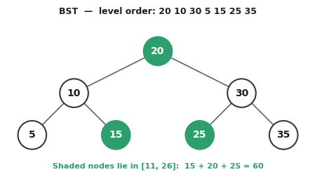

# Range Sum of BST

## Problem Statement

Given the `root` node of a Binary Search Tree (BST) and two integers `low` and `high`, return the sum of values of all nodes with a value in the **inclusive** range `[low, high]`.

A Binary Search Tree is a node-based binary tree data structure which has the following properties:
* The left subtree of a node contains only nodes with values lesser than the node’s value.
* The right subtree of a node contains only nodes with values greater than the node’s value.
* The left and right subtrees each must also be a binary search tree.

---

## Examples

### Example 1
Input : `20 10 30 5 15 25 35`
`11`
`26`
Output: `60`

**Explanation:** The nodes in the tree are provided in level-order. The nodes `15`, `20`, and `25` are within the inclusive range `[11, 26]`. `15 + 20 + 25 = 60`.

### Example 2
Input : `50 30 70 20 40 60 80`
`30`
`50`
Output: `120`

**Explanation:** The nodes `30`, `40`, and `50` are within the inclusive range `[30, 50]`. `30 + 40 + 50 = 120`.

### Example 3
Input : `8 3 10 1 6 14`
`4`
`9`
Output: `14`

**Explanation:** The nodes `6` and `8` are within the inclusive range `[4, 9]`. `6 + 8 = 14`.

---

## Node Structure (C++)

Below is the definition for the binary tree node used in this problem:

```cpp
struct Node {
    int val;
    Node *left;
    Node *right;
    
    // Constructors
    Node() : val(0), left(nullptr), right(nullptr) {}
    Node(int x) : val(x), left(nullptr), right(nullptr) {}
    Node(int x, Node *left, Node *right) : val(x), left(left), right(right) {}
};
```
## Your Task

You must write your implementation in the following file:

```text
range-sum-bst.cpp
```

Please edit the code only in the marked area (between `Your code starts from
here` and `Your code ends here`) and do not edit anywhere else in this file.


---

## Constraints

* The number of nodes in the tree is in the range `[1, 20000]`.
* `-100000 <= Node.val <= 100000`
* `-100000 <= low <= high <= 100000`
* All `Node.val` are **unique**.
* The given tree is guaranteed to be a valid Binary Search Tree.